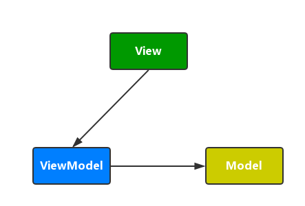
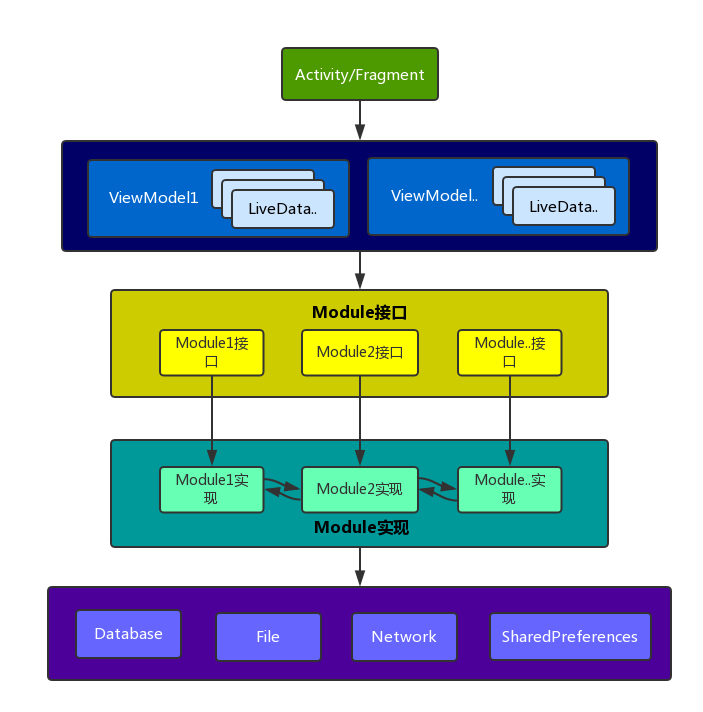

#Android之MVVM新姿势探索
###一、同一个世界，同一个痛
网上有不少关于Android架构的讨论，如`MVC`,	`MVP`,`MVVM`。这些本质上是一种代码架构思想，并没有明显的好歹之分，**关键看应用的场景以及实现的细节**。或许你跟我一样，写过很多代码，也重构过很多次。从混沌状态，进入清晰状态，随着业务发展及程序员修仙等级的良莠不齐，项目代码又再次进入隐忍状态。周而复始，bug不断，其乐无穷。

本没有架构，说的人多就有了。起初并没有明确的架构概论，Android的API已经基本规范我们的代码结构。`Activity`,`Fragment`负责UI显示和交互，以此为入口，引入一系列的工具类(xxutils, xxhelper)，实体类（xxmodel，xxbean,xxentity）和一些第三方类库（Okhttp, EventBus, Glide,GreenDao..），外加遵循基本的设计模式，一个项目雏形就出来了。再往后发展，发现UI层俨然成了一个大胖子，跑一下就大喘气。不行，我们要重构，手撕大胖子。这样就多了一些代码层次，这时面临新的问题：

* 如何规范或约束每一层的职责
* 各层次之间如何通讯（调用）
* 如何适应Android生命周期相关的交互

为了解决上面的问题，于是乎各种M\*\*架构就被总结并应用上了。近来有涉猎Android官方推出新框架[Android Architecture Components](https://developer.android.google.cn/topic/libraries/architecture/index.html)及[RxJava](https://github.com/ReactiveX/RxJava)，将两者结合起来，发现可以产生新的开发姿势。

###二、MVVM概略
不了解**Android Architecture Components**和**RxJava**的同学，最好能先查阅相关资料，了解基本使用就行。来！上图。本图来着[谷歌官方](https://developer.android.google.cn/topic/libraries/architecture/guide.html#the_final_architecture)，本文将会围绕该图的实现进行探讨。


这是一张MVVM（Model-View-ViewModle）架构图。简略介绍各个模块：

**View层** 绿色框中的`Activity/Fragment`，继承至`LifecycleActivity\LifecycleFragment`，是UI控件的宿主。核心负责：

* 更新UI控件显示，包括状态及数据
* 监听UI事件及其生命周期，驱动ViewModel

View层不直接处理任何业务逻辑及数据加工。尽量做到瘦身，代码逻辑简约，减轻UI线程负担。

**ViewModel层** 蓝色框的`ViewModel`。只做业务逻辑操作，不持有任何UI控件的引用。那数据的更新如何通知到View层，这就要仰仗`LiveData`,具体使用后面会提及。

**Model层** 橘黄色框的`Repository`及其下都是Model层。Model层就是数据层。数据来源有：

* 本地存储数据，如数据库，文件，SharedPreferences（本质也是文件）
* 内存的缓存或临时数据
* 网络数据，通过各种网络协议获取的

`Repository`是数据仓库，整合各种来源的数据，统一暴露给ViewModel层使用。官方新框架在这一层只提供给了一个新的sqlite数据库封装类库[Room](https://developer.android.google.cn/topic/libraries/architecture/room.html)，这是可选。换言之，官方只给了指导思想，未有具体方案，你或许有疑问：

* Model层如何与ViewModel通信
* Repository 如何整合各路数据，进行业务处理

现在对官方新架构组件实现MVVM应该有个基本认知，再换个姿势看看各个层次的依赖。



等等，这依赖图跟平常看到的有点不一样啊。通常View与ViewMode都是双向依赖的，即双向绑定的，即view的改动会反馈到viewmodel,反之亦然。Android官方提供的[Data Binding](https://developer.android.google.cn/topic/libraries/data-binding/index.html)类库，可实现该功能。但是看完使用后，蛋蛋有点隐隐作痛，有种当年做网站使用模板引擎的既视感。在xml布局文件添加过多逻辑，不知是一种退步还是进步。这里我们使用`LiveData`类实现单向绑定，对使用者相对友好。强调一点：**上层只依赖临近的下层，下层不可调用上层**

但是...但是新姿势在哪里啊？莫急,往下look。

### 3、开启新姿势



### 3.1、ViewModel调用Model

跟第一张比较，Model层的实现细化了许多。model是个容易误会的词，可等同与JavaBean，Entity等实体类，亦可指广义上的数据层，本文改用Module代指后者。不同的业务模块归类到不同的Module类，如用户模块`UserModule`，直播模块`LiveModule`。那**Mudule该如何封装方法给ViewModel调用？**。地球人都知道UI线程不可做耗时操作。这样Module提供的方法分两种：耗时和非耗时。

#### 非耗时
非耗时调用通常是直接内存操作的。如

```
public interface UserModule {
	...
	boolean isLogin();
	...
}
```
内存维持一个变量记录着当前的登录状态，`isLogin`直接将该变量值返回就行。

#### 耗时
耗时调用通常是跟IO相关或复杂的计算。如

```
public interface UserModule {
	...
	LoginResult login(String username, String password);
	...
}
```
登录操作通常需要服务端验证，获取用户信息，本地用户信息更新，发出登录状态变化通知等，显然不宜在UI线程执行，那只能辛苦子线程了。

子线程干完活，需要告诉调用者：回调or事件通知？这里使用回调更适合，因为**事件通知**是一对多的关系，而**回调**是一对一。一对多就意味需要做很多附加操作去保证调用的上下文，避免请求与响应错乱。

另外，若页面准备退出，而此时子线程还在干活，则需要取消任务。综合所诉，关键代码大概是这样的：

```
// 用户模块相关方法定义
public interface UserModule {
	...
	// 获取登录状态
	boolean isLogin();
	
	// 进行登录操作
	ModuleCall<LoginResult> login(String username, String password);
	...
}

// Module方法调用返回值
public class ModuleCall<T> {
	...

	public void cancel(){
		...
	}

	public void enqueue(ModuleCallback<T> callback){
		...
	}
	...
}

// Module方法调用的回调接口
public interface ModuleCallback<T> {
	void onModuleCallback(ModuleResult<T> result);
}

// Module方法调用的结果封装
public class ModuleResult<T> {
    private Throwable mThrowable;
    private T mData;

    void throwable(Throwable throwable) {
        this.mThrowable = throwable;
    }

    public Throwable throwable() {
        return mThrowable;
    }

    void data(T data) {
        this.mData = data;
    }

    public T data() {
        return mData;
    }

}

```
使用过`OkHttp`或`retrofit`类库的哥们，应该对这种封装方式很熟悉。Module方法调用后返回ModuleCall对象，再利用该对象进行异步调用和取消操作。或许，你已经注意到`UserModule`是个接口，那该如何调用啊？

### 3.2、Module的接口与实现
瞧一瞧UserModule更详细的代码

```
// UserModule接口定义
@ProxyTarget(UserModuleImpl.class)
public interface UserModule extends BaseModule {

    boolean isLogin();

    ModuleCall<LoginResult> login(String username, String password);
}

// UserModule接口实现（描述不准确啊）
public class UserModuleImpl extends BaseModuleImpl {

    public boolean isLogin() {
        return true;
    }

    public Observable<LoginResult> login(String username, String password) {
    	  // 模拟实现
    	LoginResult result = new LoginResult();
    	return Observable.just(result);
    }
    
    public String getUserName() {
    	  return "fusang";
    }
}

@Target(ElementType.TYPE)
@Retention(RetentionPolicy.RUNTIME)
public @interface ProxyTarget {
    Class<? extends BaseModuleImpl> value();
}

public class BaseModuleImpl {
	 // 获取其他模块实现类
    protected <T extends BaseModuleImpl> T getModule(Class<T> moduleClass) {
        ...
    }
}

public interface BaseModule {
}

// Module管理类
class ModuleManager {

	 // 获取指定module
    public static <T extends BaseModule> T get(Class<T> moduleClass) {
        ... 
    }

	 // 获取指定的module实现类
    static <T extends BaseModuleImpl> T getImpl(Class<T> moduleClass) {
       ...
    }
}

```

代码贴得略多了些，容我徐徐道来。首先，是否有点诧异UserModuleImpl居然不是UserModule的实现类，`login`方法，一个返回`ModuleCall<LoginResult>`，一个返回 `Observable<LoginResult>` ,但是方法签名是一样的。而`isLogin`方法又完全一样。这里使用一些约定策略：

* 一个Module接口就有相应的一个Module实现类
* Module实现类，可通过其基类`BaseModuleImpl`的`getModule`方法获取其他Module实现类，即Module实现类之间是可相互调用的。
* Module实现类阻塞的方法返回`Observable<T>`, 返回其他类型的表示非阻塞方法。
* Module接口暴露给ViewModule调用，它代理了相应的实现类的方法。

看到这里，你应该还有许多疑问：

* `Observable`是什么鬼？
* Module接口是如何关联到相应的实现类的，并调用相应的方法？

#### 关于Observable
`Observable`是鼎鼎大名的类库**RxJava**提供的类。RxJava很强大，如同胶水，可方便的组织代码。上图中最底层的数据库，文件及网络操作也可采用RxJava类封装。这样各种业务逻辑都可方便串联起来，包括其他实现类的功能，很带劲。`Observable`也具有"UI线程回调"和”任务取消“功能，那为什么不直接将`Observable`返回给ViewModel层，还要转为ModuleCall\<T\>呢，两个原因：

* 接口统一，便于调用 RxJava除了`Observable`，还有`Single`,`Flowable`,`Maybe`
* 简化代码，看MeduleCall的实现（只实现转换Observable），不用自己去设置`observeOn(AndroidSchedulers.mainThread())`(主线程回调)，以及处理冗长的回调。

```
public class ModuleCall<T> {
    private Observable<T> mObservable;
    private ModuleCallback<T> mModuleCallback;
    private Disposable mDisposable;
    private volatile boolean mDone = false;
    private volatile boolean mCanceled = false;
    private boolean mExecuted = false;

    void setObservable(Observable<T> observable) {
        mObservable = observable;
    }

    public void cancel() {
        mCanceled = true;
        if (mDisposable != null) {
            mDisposable.dispose();
        }
    }

    public boolean isDone() {
        return mDone || mCanceled;
    }

    public boolean isCanceled() {
        return mCanceled;
    }

    public void enqueue(final ModuleCallback<T> callback) {
        synchronized (this) {
            if (mExecuted) {
                throw new IllegalStateException("每个ModuleCall只能enqueue一次");
            }
            mExecuted = true;
        }
        if (mCanceled || mDone) {
            return;
        }
        mModuleCallback = callback;
        final ModuleResult<T> result = new ModuleResult<>();
        mObservable.observeOn(AndroidSchedulers.mainThread()).subscribe(new Observer<T>() {
            @Override
            public void onSubscribe(@NonNull Disposable d) {
                mDisposable = d;
            }

            @Override
            public void onNext(@NonNull T t) {
                result.data(t);
            }

            @Override
            public void onError(@NonNull Throwable e) {
                result.throwable(e);
                done();
            }

            @Override
            public void onComplete() {
                done();
            }

            private void done() {
                mDone = true;
                if (mModuleCallback == null || mCanceled) {
                    return;
                }
                mModuleCallback.onModuleCallback(result);
            }
        });
    }

}
```

#### Mdule接口关联其实现类
通过注解`ProxyTarget`将Module接口和其实现类关联起来

```
@ProxyTarget(UserModuleImpl.class)
public interface UserModule extends BaseModule {
    boolean isLogin();
    ModuleCall<LoginResult> login(String username, String password);
}
```
`UserModule`是接口，`UserModelImpl`又不是其程序语言层面的实现，那ViewModel该如何调用呢？上代码：

```
class ModuleManager {
    private static Map<Class<?>, BaseModule> mModuleCache = new ConcurrentHashMap<>();
    private static Map<Class<?>, BaseModuleImpl> mModuleImplCache = new ConcurrentHashMap<>();

	 // 获取modue接口的真正实现类
    public static <T extends BaseModule> T get(Class<T> moduleClass) {
        BaseModule module = mModuleCache.get(moduleClass);
        if (module != null) {
            return (T) module;
        }
        synchronized (mModuleCache) {
            try {
                module = mModuleCache.get(moduleClass);
                if (module == null) {
                    module = create(moduleClass);
                    mModuleCache.put(moduleClass, module);
                }
                return (T) module;
            } catch (Throwable t) {
                throw new RuntimeException("获取module失败 " + moduleClass.getName() + "  " + t);
            }
        }
    }

	 // 获取module实现类的实例（单例）
    static <T extends BaseModuleImpl> T getImpl(Class<T> moduleClass) {
        BaseModuleImpl module = mModuleImplCache.get(moduleClass);
        if (module != null) {
            return (T) module;
        }
        synchronized (mModuleImplCache) {
            try {
                module = mModuleImplCache.get(moduleClass);
                if (module == null) {
                    module = moduleClass.newInstance();
                    mModuleImplCache.put(moduleClass, module);
                }
                return (T) module;
            } catch (Throwable t) {
                throw new RuntimeException("获取moduleImpl失败 " + moduleClass.getName() + "  " + t);
            }
        }
    }

	 // 生成Module接口的代理类
    private static <T extends BaseModule> T create(Class<T> moduleClass) throws Exception {
        ProxyTarget proxyTarget = moduleClass.getAnnotation(ProxyTarget.class);
        Class<? extends BaseModuleImpl> targetClass = proxyTarget.value();
        Method[] methods = moduleClass.getDeclaredMethods();
        Method[] targetMethods = targetClass.getDeclaredMethods();

        HashMap<Method, Method> methodMap = new HashMap<>();
        // TODO 完善方法的映射
        for (Method method : methods) {
            for (Method targetMethod : targetMethods) {
                if (methodEquals(method, targetMethod)) {
                    methodMap.put(method, targetMethod);
                    break;
                }
            }
        }
        Object targetObject = getImpl(targetClass);
        return (T) Proxy.newProxyInstance(moduleClass.getClassLoader(), new Class[]{moduleClass}, new ModuleInvocationHandler(targetObject, methodMap));
    }

	 // 代理处理方法
    private static class ModuleInvocationHandler implements InvocationHandler {
        private Object mTargetObject;
        private Map<Method, Method> mMethodMap;

        public ModuleInvocationHandler(Object targetObject, Map<Method, Method> methodMap) {
            mTargetObject = targetObject;
            mMethodMap = methodMap;
        }

        @Override
        public Object invoke(Object proxy, Method method, Object[] args) throws Throwable {
            Object res = mMethodMap.get(method).invoke(mTargetObject, args);
            if (ModuleCall.class.equals(method.getReturnType())) {
                ModuleCall call = new ModuleCall();
                call.setObservable((Observable) res);
                return call;
            } else {
                return res;
            }
        }
    }

	 // 判断签名是否一样
    private static boolean methodEquals(Method method1, Method method2) {
        ...
    }
}
```

调用`ModuleManager.get(UserModule.class)`就可以获取UserModule对象。通过`ProxyTarget`注解，建立Moduel接口和Module实现类的方法的映射。再生成代理类，将接口方法的调用转换为接口实现类的调用。

至此，已经基本理清Model层的内部逻辑以及ViewModel层调用Model层的方式。但是还不够完善？

### 3.3 还是关于调用取消
下面是`LoginViewModel`的基本实现，继承至官方新架构类库提供的`ViewModel`。当`LoginViewModel`所依附的`Activity\Fragment`被销毁时会自动回调其`onCleared`方法，并将相关的Module方法取消。老铁，没毛病。莫急，倘若有很多ModuleCall，那就要手动维持这些引用，并都要在`onCleared`进行取消操作。有时大意，忘了取消就可能产生内存泄漏。倘若能将关于一个`ViewModel`的`ModuleCall`自动收集起来,在`onCleared`进行统一取消，那该是多么美妙的事情。

```
public class LoginlViewModel extends ViewModel {
    public final MutableLiveData<ModuleResult<LoginResult>> loginResult = new MutableLiveData<>();
    private ModuleCall<LoginResult> mLoginCall;
    
    public void login(String username, String password) {
        mLoginCall = ModuleManager.getModule(UserModule.class).login(username, password);
        mLoginCall.enqueue(new ModuleCallback<LoginResult>() {
            @Override
            public void onModuleCallback(ModuleResult<LoginResult> result) {
                loginResult.setValue(result);
            }
        });
    }

    public boolean isLogin() {
        return getModule(UserModule.class).isLogin();
    }
    
    @Override
    protected void onCleared() {
        if (mLoginCall!=null) {
            mLoginCall.cancel();
        }
    }
}
```
解决方法还是动态代理，对Moduel接口二次代理，即不直接使用`ModuleManager.getModule`，而是调用代理类。代理类会将收集ModuleCal，便于统一处理。抽象出两个基础类`BaseViewModel`和`BaseAndroidViewModel`

```
public class BaseViewModel extends ViewModel {
    private ModuleDelegate mDelegate = new ModuleDelegate();

    protected <T extends BaseModule> T getModule(Class<T> moduleClass) {
        return mDelegate.getModule(moduleClass);
    }

    @Override
    protected void onCleared() {
        mDelegate.cancelAll();
        super.onCleared();
    }
}

public class BaseAndroidViewModel extends AndroidViewModel {
    private ModuleDelegate mDelegate = new ModuleDelegate();

    public BaseAndroidViewModel(Application application) {
        super(application);
    }

    protected <T extends BaseModule> T getModule(Class<T> moduleClass) {
        return mDelegate.getModule(moduleClass);
    }

    @Override
    protected void onCleared() {
        mDelegate.cancelAll();
        super.onCleared();
    }
}
```
再看`ModuleDelegate`的实现

```
public class ModuleDelegate {
    private static Map<Class<?>, BaseModule> mModuleCache = new ConcurrentHashMap<>();
    private ModuleCalls mModuleCalls = new ModuleCalls();

    public <T extends BaseModule> T getModule(Class<T> moduleClass) {
        BaseModule module = mModuleCache.get(moduleClass);
        if (module != null) {
            return (T) module;
        }
        synchronized (mModuleCache) {
            try {
                module = mModuleCache.get(moduleClass);
                if (module == null) {
                    InvocationHandler invocationHandler = new ModuleInvocationHandler(ModuleManager.get(moduleClass), mModuleCalls);
                    module = (T) Proxy.newProxyInstance(moduleClass.getClassLoader(), new Class[]{moduleClass}, invocationHandler);
                    mModuleCache.put(moduleClass, module);
                }
                return (T) module;
            } catch (Throwable t) {
                throw new RuntimeException("获取module代理 失败 " + moduleClass.getName() + "  " + t);
            }
        }
    }

    public void cancelAll() {
        mModuleCalls.cancel();
        // 清理缓存的module
        synchronized (mModuleCache) {
            mModuleCache.clear();
        }
    }

    private static class ModuleInvocationHandler implements InvocationHandler {
        private Object mTarget;
        private ModuleCalls mModuleCalls;

        public ModuleInvocationHandler(Object target, ModuleCalls moduleCalls) {
            mTarget = target;
            mModuleCalls = moduleCalls;
        }

        @Override
        public Object invoke(Object proxy, Method method, Object[] args) throws Throwable {
            Object res = method.invoke(mTarget, args);
            if (ModuleCall.class.equals(method.getReturnType())) { // 收集返回的moduleCall
                mModuleCalls.add((ModuleCall) res);
            }
            return res;
        }
    }

    private static class ModuleCalls {
        private List<ModuleCall> mModuleCalls;

        public void add(ModuleCall call) {
            ...
        }

        public void cancel() {
            ...
        }
    }
}
```
这种方案有个明显的缺点：一个ViewModel调用了多少个Module，就将产生多少个Module代理对象，虽然ViewModel销毁后，这些代理对象也随之可被回收，还是有些性能代价。现在`LoginViewModel`可简化为：

```
public class LoginlViewModel extends ViewModel {
	public final MutableLiveData<ModuleResult<LoginResult>> loginResult = new MutableLiveData<>();
    
    public void login(String username, String password) {
        ModuleCall<LoginResult> loginCall = getModule(UserModule.class).login(username, password);
        loginCall.enqueue(new ModuleCallback<LoginResult>() {
            @Override
            public void onModuleCallback(ModuleResult<LoginResult> result) {
                loginResult.setValue(result);
            }
        });
    }

    public boolean isLogin() {
        return getModule(UserModule.class).isLogin();
    }
}
```

### 3.3 View与ViewModel交互
官方架构提供的`LiveData`可实现数据驱动UI,如下代码：

```
public class LoginActivity extends LifecycleActivity implements View.OnClickListener {
    private LoginViewModel mLoginViewModel;
    private Button mLoginBtn;

    @Override
    protected void onCreate(@Nullable Bundle savedInstanceState) {
        super.onCreate(savedInstanceState);
        setContentView(R.layout.login_activity_layout);

        // step0 获取相关的viewModel
        mLoginViewModel = ViewModelProviders.of(this).get(LoginViewModel.class);

        // step1 获取view
        mLoginBtn = (Button) findViewById(R.id.loginBtn);

        // step2 设置监听
        mLoginBtn.setOnClickListener(this);

        // step3 绑定数据
        mLoginViewModel.loginResult.observe(this, mLoginObserver);
    }

    private Observer<ModuleResult<Boolean>> mLoginObserver = new Observer<ModuleResult<Boolean>>() {
        @Override
        public void onChanged(@Nullable ModuleResult<Boolean> result) {
            Toast.makeText(getApplicationContext(), "data=" + result.data() + " e=" + result.throwable(), Toast.LENGTH_SHORT).show();
        }
    };

    public void onClick(View view) {
        switch (view.getId()) {
            case R.id.loginBtn:
                mLoginViewModel.login("fusang", "abc123456");
                break;

        }
    }
}
```
通过官方框架提供的`ViewModelProviders.of(this).get(LoginViewModel.class)`可获取到`LoginViewModel`。显然`LoginActivity`核心只做两件事情：

* 监听事件，调用ViewModel的相关方法
* 绑定数据，数据改变时，进行UI更新操作

### 4、再说两句
结合官方提供的新架构类库及强大的RxJava，再加上约束（规范）各个层次调用，可快速搭建一个健壮的常规App问题。当然这只是一个应用的大概，还有很多问题待探索：

* 多进程各个Module如何通讯
* 大型项目，并行开发，如何处理未实现的Module，实现快速编译
* 复杂的独立UI控件，其中包含一些复杂的业务逻辑处理，如播放器控件，该如何调用调用Mudele
* 事件通知（如EventBus）往往少不了，全局满天飞的事件该如何约束，使用不当，很容易造成各个层次混乱

最后的最后，想看源码的可以戳[这里]()。官方新架构类库还是alpha版，整套新姿势还未经过严格测试及生产环境验证，慎用。